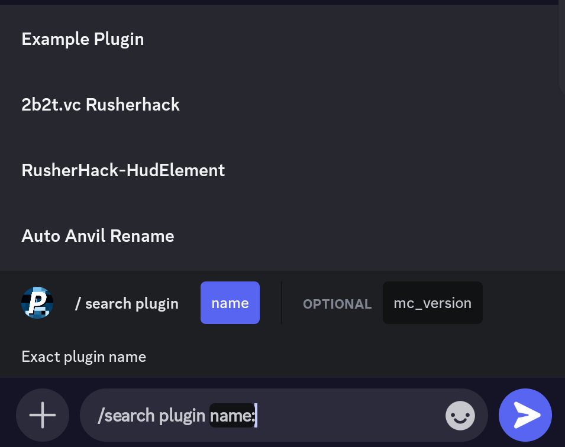
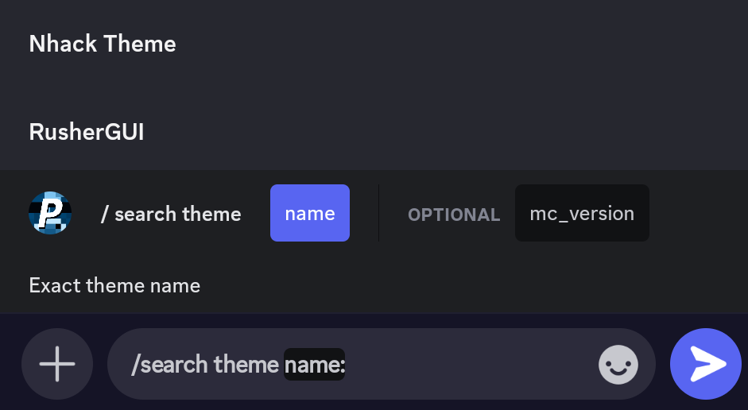
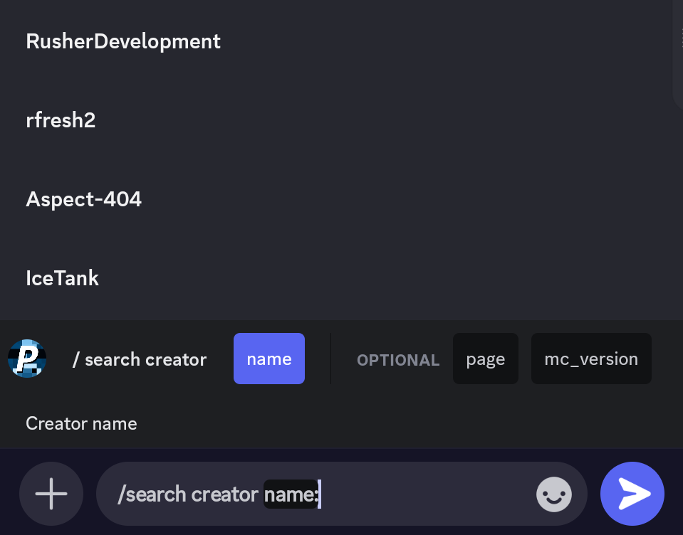
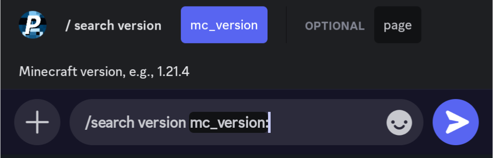

  
    
  
  
  

# Rusher-Plugin-Bot

Rusher-Plugin-Bot is a Discord bot designed to explore and display information from the official
[Rusherhack Plugin and Theme registry](https://github.com/RusherDevelopment/rusherhack-plugins).
It provides fast, searchable access to plugin data directly inside Discord using slash commands and clean, structured embeds.

## Overview

The bot retrieves plugin and theme metadata from the public
[RusherDevelopment registry](https://github.com/RusherDevelopment/rusherhack-plugins/blob/main/data/plugins-and-themes.yml)
and formats it into clear informational responses. Its goal is to make discovering, comparing, and browsing
RusherHacks extensions effortless without needing to search GitHub manually.

## Features & Commands

Rusher-Plugin-Bot provides fast, searchable access to the official Rusherhack Plugin & Theme registry directly inside Discord.  
Every feature is powered by a clean, structured slash command system.

---

### Search Plugins — `/search plugin`

Look up any plugin by name and instantly view:

- Description and purpose  
- Latest release information  
- Supported Minecraft versions  
- Creator details and avatar  
- GitHub metadata (stars, last commit, downloads)

**Screenshot**

  

<strong>Parameters</strong>

| Name         | Type   | Required | Description                                  |
|--------------|--------|----------|----------------------------------------------|
| `name`       | string | Yes      | Exact plugin name (autocomplete enabled)     |
| `mc_version` | string | No       | Filter by a specific Minecraft version       |

---

### Search Themes — `/search theme`

Find UI themes using the same structured, rich output used for plugins.

**Screenshot**

  

<strong>Parameters</strong>

| Name         | Type   | Required | Description                                   |
|--------------|--------|----------|-----------------------------------------------|
| `name`       | string | Yes      | Exact theme name (autocomplete enabled)       |
| `mc_version` | string | No       | Filter by Minecraft version                   |

---

### Browse by Creator — `/search creator`

List all plugins and themes created by a specific developer.  
Ideal for exploring a creator’s full catalog.

**Screenshot**

  

<strong>Parameters</strong>

| Name         | Type    | Required | Description                                   |
|--------------|---------|----------|-----------------------------------------------|
| `name`       | string  | Yes      | Creator name (autocomplete enabled)           |
| `page`       | integer | No       | Page number (default: 1)                      |
| `mc_version` | string  | No       | Filter results by Minecraft version           |

---

### Filter by MC Version — `/search version`

View all plugins and themes that support a specific Minecraft version or version range, such as `1.20.1–1.21.4`.

**Screenshot**

  

<strong>Parameters</strong>

| Name         | Type    | Required | Description                                   |
|--------------|---------|----------|-----------------------------------------------|
| `mc_version` | string  | Yes      | Version to match (e.g., `1.21.4`)             |
| `page`       | integer | No       | Page number (default: 1)                      |

---

### How It Works

- Loads the official
  [`plugins-and-themes.yml`](https://github.com/RusherDevelopment/rusherhack-plugins/blob/main/data/plugins-and-themes.yml)
  from GitHub  
- Normalizes and caches all plugin/theme data  
- Adds GitHub metadata (stars, downloads, last commit)  
- Provides autocomplete for plugin, theme, and creator names  
- Supports version filtering and pagination

## Changelog

This project maintains an automatically generated changelog in [CHANGELOG.md](./CHANGELOG.md).  
The changelog is built from the Git commit history by a GitHub Actions workflow and is ordered from newest to oldest changes.

## Contributing

Contributions, suggestions, and improvements are welcome.

- Open an issue if you find a bug or want to request a feature.
- Submit a pull request for bug fixes, enhancements, or documentation updates.
- Keep changes focused and clearly described in the PR description.
- For larger changes, consider opening an issue first to discuss the approach.

A dedicated [CONTRIBUTING.md](./CONTRIBUTING.md) file will describe the full contribution process and coding guidelines.
